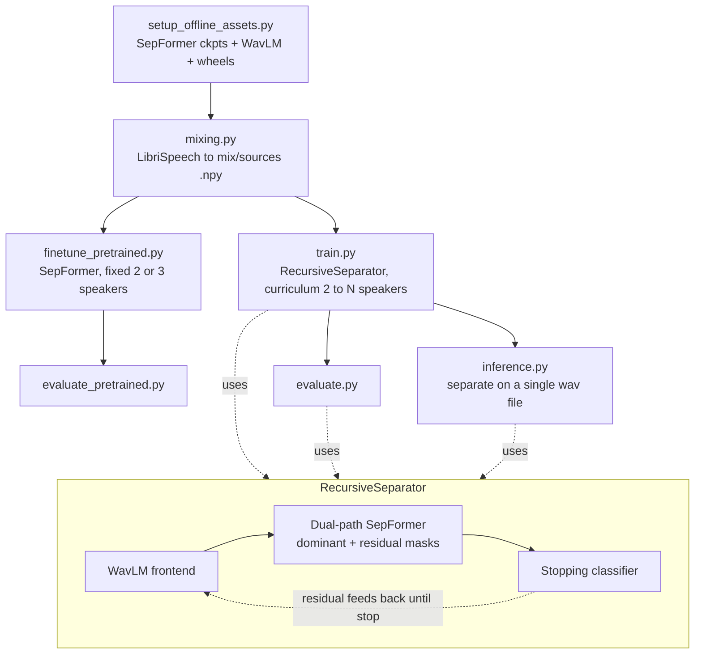

# Recursive Multi-Speaker Source Separation

A speaker-count-agnostic source separation pipeline. A WavLM-conditioned
recursive separator repeatedly peels one dominant speaker off a mixture
until a learned stopping classifier says no speech remains — so it handles
2, 3, 4, or 5+ overlapping speakers without knowing the count in advance.
A finetuned SepFormer (fixed 2-speaker / 3-speaker) is trained alongside it
as a baseline.

## Contents

```
.
├── setup_offline_assets.py   # one-time download: SepFormer ckpts, WavLM, pip wheels
├── mixing.py                 # builds synthetic multi-speaker mixtures from LibriSpeech
├── dataset.py                # PyTorch Dataset + collate_fn for variable speaker counts
├── model.py                  # WavLMFrontEnd, dual-path SepFormer, RecursiveSeparator
├── losses.py                 # SI-SDR, best-of-two SI-SDR (dominant/residual), stopping BCE
├── train.py                  # curriculum training (2 -> N speakers) of RecursiveSeparator
├── finetune_pretrained.py    # finetunes the pretrained SepFormer baseline (2 or 3 spk)
├── evaluate.py                # evaluates RecursiveSeparator with greedy SI-SDR matching
├── evaluate_pretrained.py    # evaluates the finetuned SepFormer baseline
├── inference.py               # run RecursiveSeparator on a single wav file
├── run_pipeline.sh            # end-to-end driver script (mix -> train -> evaluate)
└── requirements.txt
```

## Architecture



**Data flow.** `mixing.py` scans a LibriSpeech-style directory tree
(`speaker_id/.../*.flac`), draws a random number of speakers per example,
sums their (optionally reverb/noise-augmented) clips into a mixture, and
saves `mix_{idx}.npy` / `sources_{idx}.npy` pairs plus a `manifest.npy` used
for curriculum staging.

**Two training branches, one shared frontend:**
- **Baseline** (`finetune_pretrained.py` / `evaluate_pretrained.py`) finetunes
  SpeechBrain's pretrained `sepformer-wsj02mix` / `sepformer-wsj03mix`
  checkpoints on fixed 2- or 3-speaker mixtures at 8kHz, using
  permutation-invariant SI-SDR loss.
- **Recursive separator** (`train.py` / `evaluate.py` / `inference.py`) trains
  the `RecursiveSeparator` in `model.py`: a WavLM frontend (top 2 layers
  finetuned) conditions a dual-path transformer SepFormer via FiLM; the
  separator emits a *dominant* speaker estimate and a *residual*; a small
  stopping classifier decides whether to recurse on the residual. Training
  uses `best_of_two_si_sdr_loss`, which picks whichever remaining ground-truth
  source best matches the dominant/residual split at each step, plus a
  curriculum that grows the max speaker count per stage (2 → `max_speaker_cap`).
- **Evaluation** greedily matches each separated stream to the closest
  remaining ground-truth source by SI-SDR and reports speaker-count error
  alongside separation quality.

## Setup

```bash
pip install -r requirements.txt
# or, to build a fully offline-capable environment (e.g. no-internet GPU node):
python setup_offline_assets.py --out_dir ./offline_assets
```

`setup_offline_assets.py` downloads:
1. pip wheels for `speechbrain`, `hyperpyyaml`, `sentencepiece`, `ruamel.yaml<0.19.0` (for `pip install --no-index` later)
2. Pretrained SepFormer checkpoints: `speechbrain/sepformer-wsj02mix` and `speechbrain/sepformer-wsj03mix`
3. `microsoft/wavlm-base-plus` (the recursive separator's frontend encoder)

## Data

Point `--speech_root` at a LibriSpeech-style tree (e.g. `train-clean-100`),
organized as `speaker_id/chapter_id/*.flac`. Any similarly-structured speech
corpus works.

## Usage

Run the full pipeline:

```bash
SPEECH_ROOT=./data/librispeech-clean ASSETS_DIR=./offline_assets ./run_pipeline.sh
```

Or run stages individually:

```bash
# 1. Build mixtures
python mixing.py --speech_root ./data/librispeech-clean --out_dir ./working/train_dataset \
  --n_samples 5000 --min_speakers 2 --max_speakers 5 --sample_rate 16000

# 2. Train the recursive separator (curriculum: 2 -> 5 speakers)
python train.py --data_dir ./working/train_dataset --checkpoint_dir ./working/checkpoints \
  --epochs_per_stage 15 --batch_size 32 --lr 1e-4 --max_iterations 6 \
  --wavlm_path ./offline_assets/wavlm-base-plus

# 3. Evaluate
python evaluate.py --checkpoint ./working/checkpoints/recursive_separator_v2.pt \
  --data_dir ./working/test_dataset --wavlm_path ./offline_assets/wavlm-base-plus

# 4. Run inference on a single file
python inference.py --checkpoint ./working/checkpoints/recursive_separator_v2.pt \
  --input_wav ./mixture.wav --out_dir ./separated_out
```

`inference.py` writes one `speaker_N.wav` per detected speaker to `--out_dir`.
## Results

Metrics from the original run of this pipeline (LibriSpeech `train-clean`,
8000 training mixtures per SepFormer stage / 5000 for the recursive
separator, settings as in `run_pipeline.sh`). Re-running with different
data or hyperparameters will produce different numbers — treat these as a
reference point, not a guarantee.

**SepFormer baseline** (`finetune_pretrained.py` → `evaluate_pretrained.py`), fixed speaker count, 8kHz:

| Model | Test mean SI-SDR | Best val SI-SDR (training) |
|---|---|---|
| SepFormer, finetuned, 2 speakers | 18.92 dB | 19.33 dB |
| SepFormer, finetuned, 3 speakers | 13.79 dB | 13.84 dB |

**RecursiveSeparator** (`train.py` → `evaluate.py`), variable speaker count (2–5), 16kHz, greedy SI-SDR matching against ground truth:

| Speaker count | Mean SI-SDR | Separated streams (n) |
|---|---|---|
| 2 speakers | 4.93 dB | 141 |
| 3 speakers | 0.63 dB | 196 |
| 4 speakers | -1.87 dB | 265 |
| 5 speakers | -3.50 dB | 337 |

Mean absolute speaker-count error: **0.47** (average difference between the number of speakers the model detects via the stopping classifier and the true number in the mixture).

**Reading these numbers:** the fixed-count SepFormer baseline (trained and
evaluated only ever on exactly 2 or exactly 3 speakers) outperforms the
recursive model on separation quality — expected, since it doesn't have to
also solve "how many speakers are there." The recursive separator trades
some SI-SDR for the ability to handle an unknown, variable number of
speakers (2 to 5 in this run) with a single model and reasonably accurate
speaker-count estimation. SI-SDR degrades and count error grows as more
speakers overlap, which tracks with the general difficulty of the task.


- The SepFormer baseline track uses **8kHz** audio (matches the pretrained
  WSJ0-mix checkpoints); the WavLM/recursive track uses **16kHz** (matches
  WavLM's pretraining). `mixing.py --sample_rate` controls this per dataset.
- `train.py` is resumable: it checkpoints after every epoch and picks the
  curriculum stage back up on restart.
- This repo consolidates two Kaggle notebooks (an offline-asset-download
  notebook and the training/eval notebook) into a single, runnable project.
## Notes

- The SepFormer baseline track uses **8kHz** audio (matches the pretrained
  WSJ0-mix checkpoints); the WavLM/recursive track uses **16kHz** (matches
  WavLM's pretraining). `mixing.py --sample_rate` controls this per dataset.
- `train.py` is resumable: it checkpoints after every epoch and picks the
  curriculum stage back up on restart.
- This repo consolidates two Kaggle notebooks (an offline-asset-download
  notebook and the training/eval notebook) into a single, runnable project.

## License

Add a license of your choice (e.g. MIT) before publishing.
